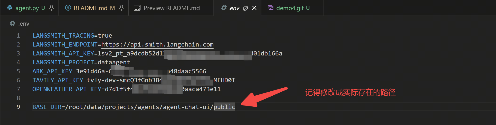

# dataagent
这个GitHub仓库是[学习视频](https://www.bilibili.com/video/BV1uV1yBHE2o/?spm_id_from=333.788.videopod.episodes&vd_source=5985951fd0bd9848a10e8855a46f1d56)的复现，

笔记在：https://siwrc302o4r.feishu.cn/wiki/Kda8wNjttion29kRw1wcHJZLnnV?fromScene=spaceOverview#share-P1tbdDp9joO8SBxUaAjcxMUvnnb

下面的流程有些内容省略了，详细看https://github.com/FelixFu520/langchain_chatbot.git

学习视频中用的mysql数据库， 我给改成了sqlite
## 环境安装
### 1. 安装sqlite数据库&生成数据
```
apt install sqlite3
sqlite3 --version
python sqlite_init.py
```
### 2. 注册langsmith&获取 api key

复制Configure environment，然后在新建.env文件，把环境变量粘贴到.env文件中
### 3. 注册Tavily&获取api key
https://app.tavily.com/home
### 4. 注册火山引擎豆包大模型&获取api key
https://console.volcengine.com/ark
### 5. 注册OpenWeather&获取api key
https://openweathermap.org/api/

这个demo没用到查询天气工具，所以可以忽略这个api
### 6. 完整的.env如下

### 7. 安装环境
```
cd $HOME
git clone https://github.com/FelixFu520/dataagent.git
cd dataagent
uv sync
source .venv/bin/activate
```
## 运行后台
```
source .venv/bin/activate
langgraph dev
```
## 运行前端
### 1. 安装
新起个终端
```
cd $HOME
git clone https://github.com/langchain-ai/agent-chat-ui.git
cd agent-chat-ui

# 安装nvm, node.js, npm, pnpm
curl -o- https://raw.githubusercontent.com/nvm-sh/nvm/v0.39.7/install.sh | bash
source ~/.bashrc 
nvm list-remote # 查看可用的 Node.js 版本
nvm install --lts # 安装一个稳定版本
node --version
npm --version
npm install -g pnpm
pnpm --version

# 安装项目依赖
pnpm install
```
### 2. 运行
```
pnpm dev
```
修改下图中的`Assistant/Graph ID`为langsmith中设置的名称，我这里是`data_agent`, 然后把langsmith的apikey拷贝过来, 就是前面贴到.env文件中的LANGSMITH_API_KEY

## 注意
我用的远程服务器跑的项目， 所以端口都是通过cursor转发的，如果需要部署的话，路由需要调整下
